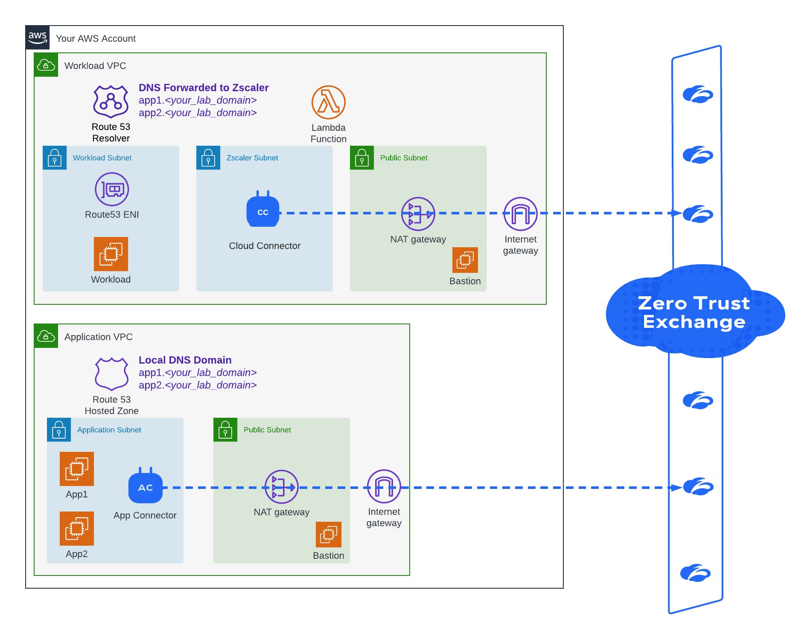
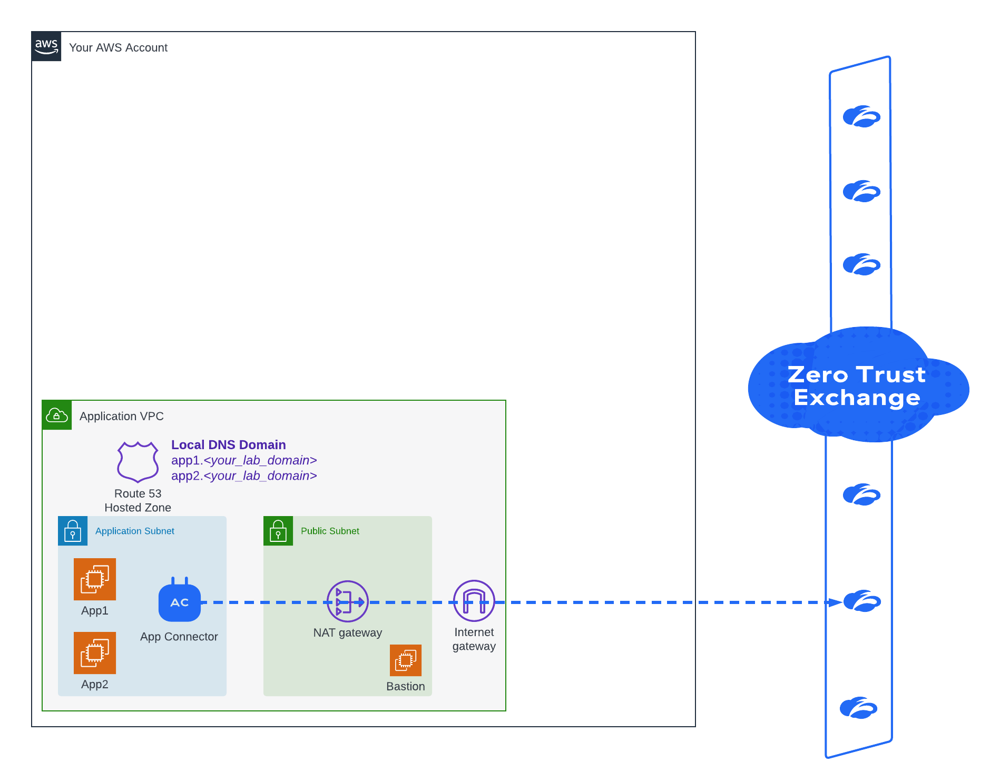
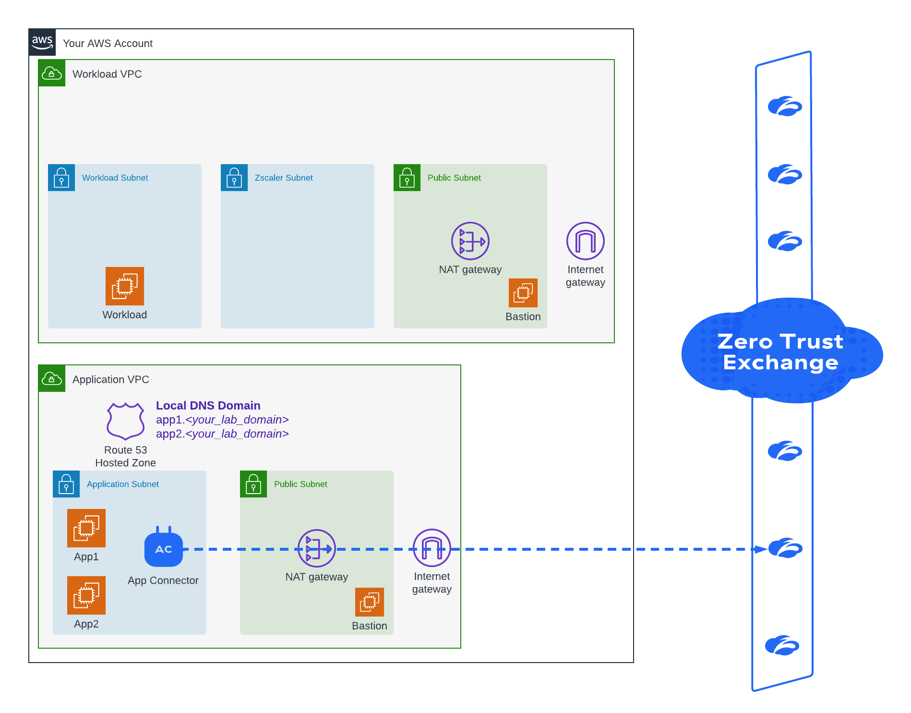
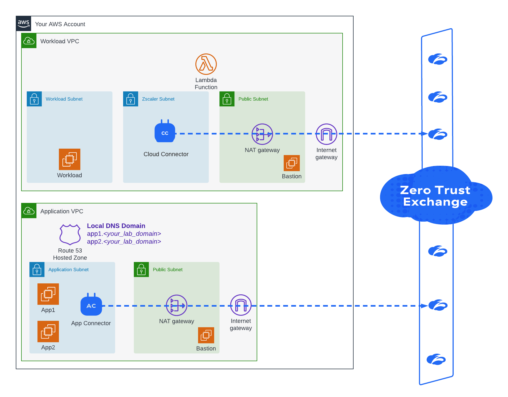

# Zero Trust for Workloads (ZPA) Hands-On Lab

The Zscaler Hands-On Lab uses these AWS CloudFormation Templates to build out the required lab infrastructure. This includes VPCs, subnets, NAT and 
Internet Gateways, Route Tables, App and Workload EC2 instances, and Zscaler components. 

> *Watch this video to get an overview of all the lab steps:*
<a href="https://www.loom.com/share/c8f0cdcbf1ec4845b63853e6b2c15e80">
    
LAB00 - ZPA for Workload Lab Topology Overview - Watch Video (Right-Click & Open Link in New Tab)

    
  </a>
 
---

# **Table of Contents**

- [Prerequisites](#prerequisites)
- [Lab Instructions](#lab-instructions)
  - Create a ZPA App Connnector Provisioning Key
  - Deploy the Application VPC Resources
  - Deploy the Workload VPC Resources
  - Deploy the Cloud Connector Resources
  - Verify No Connectivity Between VPCs
  - Configure ZPA Application Segments
  - Configure ZPA Access Policy
  - Configure Cloud Connector Traffic Forwarding Policy
  - Deploy AWS DNS Resolvers for Lab Domain
  - Configure Workload Subnet to Route to Cloud Connector
  - Test Workload to Private App Access
  - Tear Down Lab

 

--- 

# **Prerequisites**
[(Back to top)](#table-of-contents)

## Git

- Clone this repo to obtain all the required CloudFormation Templates. 
- You can also manually download this repo by clicking the green "Repo" button > Download ZIP.

## AWS Account

- An AWS Account is required to deploy this lab. 
- The templates use the smallest instances sizes possible for minimal costs.

## AWS EC2 SSH Key

- All the templates that deploy EC2 instances require an existing AWS Key Pair to be selected. 
- Please create a Key Pair prior to starting this lab or use an exising Key Pair.
- This can be done in AWS > EC2 > Key Pairs > Create key pair
- [For help, see this AWS KB Article on Creating Key Pairs](https://docs.aws.amazon.com/AWSEC2/latest/UserGuide/create-key-pairs.html)

## Cloud Connector

- All Cloud Connector prerequisites should be completed as normal. This is out of scope for the lab.
- The Cloud Connector tenant must have the ZPA-SERVER-PRE SKU enabled
- Cloud Connector API Key and Credentials must be stored in AWS Secrets Manager in the same Account and Region you plan to deploy the lab
- A Cloud Connector AWS Provisioning Template needs to exist. 
- [For help, see the Cloud Connector POV Tenant Prep Guide for SEs](https://docs.google.com/document/d/17imm9_A6ByKAbDOeVGIAQQGW0rRxig5RLiXG0RAYc44/edit#heading=h.1kaphb5p9m0k)
- [For help, see this Cloud Connector AWS Prerequistes Guide](https://docs.google.com/document/d/1Fvo151a_bcj-p8xX7y3FOeh2uKhXxf5SQJ9c7mzWNv8/edit)
- [For more help, see the Cloud Connector Help Portal on this topic](https://help.zscaler.com/cloud-connector/deploying-cloud-connector-amazon-web-services)

## Zscaler Private Access

- A Zscaler Private Access (ZPA) tenant is required with administrative privileges

 

---

# **Lab Instructions**
[(Back to top)](#table-of-contents)

## **1. Create a ZPA App Connnector Provisioning Key**

<a href="https://www.loom.com/share/0bde467156dc4c66bf29a976ec4a8ae7" target="_blank">
    
LAB01 - Create ZPA App Connector Provisioning Key - Watch Video (Right-Click & Open Link in New Tab)

    
  </a>
    

1. Log into the ZPA Admin Console [https://admin.private.zscaler.com](https://admin.private.zscaler.com)
1. Navigate to Administration > App Connectors
1. Click Add App Connector
1. Select Create New Provisioning Key and click Next
1. Select the Connector certificate and click Next
1. Select Add App Connector Group and fill out the following:
    * Name: ZT for Workloads AWS Lab
    * Scroll down to the Map, search for "Northern Virginia, VA, USA" for the Location
1. Click Next
1. Provide the following App Connector information:
    * Name: ZT for Workloads AWS Lab Connectors
    * Maximum Reuse of Provisioning Key: 1
1. Click Next
1. Click Save
1. Copy the App Connector Provisioning Key
    > **_NOTE:_** You will need this in the next section
    > **_NOTE:_** If you forget to copy the key, you can navigate to App Connector Provisioning Keys to copy it again later
1. Click Done

 

## **2. Deploy the Application VPC Resources**

<a href="https://www.loom.com/share/4b5cd3ee36894c21a15693d0b493a483" target="_blank">
    
LAB02 - Deploy Application VPC - Watch Video (Right-Click & Open Link in New Tab)

    
  </a>
    

1. Log into your AWS Account
1. Change to the following region: *US East (N. Virginia) us-east-1*. 
    > **_NOTE:_** You can use other regions but this lab guide and CloudFormationtemplates were built in the us-east-1 region so I know it works.
1. Navigate to the CloudFormation service
1. Click Create Stack > With new resources (Standard)
1. Select the Upload a template file option
1. Click Choose file
1. Navigate to the directory where you cloned/downloaded the CFTs in this repo
1. Select the file: 1-Create_Application_VPC.yaml
1. Click Next
    * Provide a stack name: ZPACCLAB-APPVPC
    * Fill out the My IP Address field with your Public IP Address (this can be found at ip.zscaler.com, ipchicken.com, etc). 
        > **_NOTE:_** This is used to lock down SSH Access to the Public Bastion Host.
    * Select your Key Pair in the EC2 Key Pair field
    * Leave the default environment name
    * Paste your ZPA App Connector Provisioning Key into the ProvisioningKey field
    * Type a domain name to use for the lab in the Domain field. This will create a private DNS Zone only so you can use any domain you want
    * Select the region you are deploy the resources into. It must be the same region you are currently using within the AWS admin console
1. Click Next
1. Click Add new tag
    * Key: Owner
    * Value: your_first_name
1. Click Next
1. Check the box for I acknowledge that AWS CloudFormation might create IAM resources
1. Click Submit
1. Wait until the CloudFormation Stack Status changes from CREATE_IN_PROGRESS (blue) to CREATE_COMPLETE (green) before continuing
    > **_NOTE:_** This can take serveral minutes to complete

 

## **3. Deploy the Workload VPC Resources**

<a href="https://www.loom.com/share/cb7b79e9f4514bb8bd65e139fc4ab994" target="_blank">
    
LAB03 - Deploy Workload VPC - Watch Video (Right-Click & Open Link in New Tab)

    
  </a>
    

1. Navigate to AWS Admin Console > CloudFormation service
1. Click Create Stack > With new resources (Standard)
1. Select the Upload a template file option
1. Click Choose file
1. Navigate to the directory where you cloned/downloaded the CFTs in this repo
1. Select the file: 2-Create_Workload_VPC.yaml
1. Click Next
    * Provide a stack name: ZPACCLAB-WKLDVPC
    * Fill out the My IP Address field with your Public IP Address (this can be found at ip.zscaler.com, ipchicken.com, etc). 
        > **_NOTE:_** This is used to lock down SSH Access to the Public Bastion Host.
    * Select your Key Pair in the EC2 Key Pair field
    * Leave the default environment name
1. Click Next
1. Click Add new tag
    * Key: Owner
    * Value: your_first_name
1. Click Next
1. Check the box for I acknowledge that AWS CloudFormation might create IAM resources
1. Click Submit
1. Wait until the CloudFormation Stack Status changes from CREATE_IN_PROGRESS (blue) to CREATE_COMPLETE (green) before continuing
    > **_NOTE:_** This can take serveral minutes to complete

 

## **4. Deploy the Cloud Connector Resources**

<a href="https://www.loom.com/share/799ed07f639b4de5962f090945346e89" target="_blank">
    
LAB04 - Deploy Cloud Connector - Watch Video (Right-Click & Open Link in New Tab)

    
  </a>
    

1. Navigate to AWS Admin Console > CloudFormation service
1. Click Create Stack > With new resources (Standard)
1. Select the Upload a template file option
1. Click Choose file
1. Navigate to the directory where you cloned/downloaded the CFTs in this repo
1. Select the file: 3-Create_Macro.yaml
1. Click Next and provide the following:
    * Stack Name: ZPACCLAB-MACRO
1. Click Next
1. Click Add new tag
    * Key: Owner
    * Value: your_first_name
1. Click Next
1. Check the box for I acknowledge that AWS CloudFormation might create IAM resources
1. Click Submit
1. Click Create Stack > With new resources (Standard)
1. Select the Upload a template file option
1. Click Choose file
1. Select the file: 4-Create_CloudConnector.yaml
1. Click Next and Provide the following:
    * Stack Name: ZPACCLAB-CC
    * Select the Workload VPC Created Previously (ZPACCLAB-WKLDVPC)
    * Select the AZ: us-east-1a
    * Select the Subnet in the Workload VPC: ZSSubnet
    * Select your EC2 Key Pair
    * Keep the Instance Size: small
    * Keep the Instance Type: t3.medium
    * Paste your Cloud Connector AWS Provisioning URL
    * Paste the name of the AWS Secrets Manager your Cloud Connector API Key and Credentials are stored in
    * Keep the Probe Port: 50000
1. Click Next
1. Click Add new tag
    * Key: Owner
    * Value: your_first_name
1. Click Next and check the boxes for:
    * I acknowledge that AWS CloudFormation might create IAM resources.
    * I acknowledge that AWS CloudFormation might create IAM resources with custom names.
    * I acknowledge that AWS CloudFormation might require the following capability: CAPABILITY_AUTO_EXPAND
1. Click Submit
    > **_NOTE:_** Cloud Connectors can take up to 10 minutes to be Active after deployed
1. Log into your Cloud Connector admin portal
1. Verify the Cloud Connector is Active (Green) in the Dashboard
    > **IMPORTANT:_** DO NOT PROCEED UNTIL THIS HAPPENS

 

## **5. Verify No Connectivity between VPCs**

<a href="https://www.loom.com/share/88c09858d0e84acf913abba1eadf9f3a" target="_blank">
    
LAB05 - Verify No Connectivity Between VPCs - Watch Video (Right-Click & Open Link in New Tab)

    
  </a>
    

1. Navigate to AWS Admin Console > CloudFormation service
1. Click the radio button for the App VPC Stack (ZPACCLAB-APPVPC)
1. Click the Outputs tab
1. Copy the AppServer1FQDN (it will be: app1.<your_lab_domain>)
1. Navigate to AWS Admin Console > EC2 service > Instances (running)
1. Select the App1 EC2 Instance (ZPACCLAB-APPVPC-App1)
1. Click Connect > Session Manager > Connect
    > **_NOTE:_** A new browser tab will open with a session to the App Server (Linux terminal)
1. Run the following command to verify local DNS is working: dig +short app1.<your_lab_domain>
    > **_NOTE:_** A private IP Address in the 10.192.0.0/16 address space will be returned
1. Repeat for the second app server: dig +short app2.<your_lab_domain>
    > **_NOTE:_** A private IP Address in the 10.192.0.0/16 address space will be returned
1. Run the following command to verify the web server is working: curl app1.<your_lab_domain>
    > **_NOTE:_** The web page response is a simple 1 line "Private Application 1"
1. Repeat for the second app server: curl app2.<your_lab_domain>
    > **_NOTE:_** The web page response is a simple 1 line "Private Application 2"
1. Close the SSH session browser tab and go back to EC2 Instances
1. Select the Workload EC2 Instance (ZPACCLAB-WKLDVPC-Workload)
1. Click Connect > Session Manager > Connect
1. Run the following command to verify DNS does NOT work: dig +short app1.<your_lab_domain>
    > **_NOTE:_** No IP Address should be returned
1. Repeat for the second app server: dig +short app2.<your_lab_domain>
    > **_NOTE:_**  No IP Address should be returned*
1. Run the following command to verify no connectivity to the web apps: curl app1.<your_lab_domain>
    > **_NOTE:_** You should get an error like "curl: (6) Could not resolve host: app1.<your_lab_domain>
1. Open a new tab and navigate to AWS Admin Console > CloudFormation (or open the tab)
1. Make sure the App VPC Lab (ZPACCLAB-APPVPC) stack is selected > Outputs tab
1. Copy the IP Address for the AppServer1IP object
1. Run the following command to verify no connectivity to the web apps via IP: curl <app1_IP_address>
    > **_NOTE:_** You should get an error like "curl: (7)( Failed to connect to <ip_address> port 80 ... : No route to host"
1. Close the session tab

 

## **6. Configure ZPA Application Segments**

<a href="https://www.loom.com/share/e7b62299978c4e6dad2c4ee7a62940c5" target="_blank">
    
LAB06 - Create ZPA App Segment - Watch Video (Right-Click & Open Link in New Tab)

    
  </a>
    

1. Log into the ZPA Admin Console
1. Navigate to Administration > Application Segments
1. Click Add Application Segment (top-right corner)
    > **_NOTE:_** The button might be hidden, so if you don't see it, click the 3-bullet button to see it
1. Fill in the following details:
    * Name: ZTWKLD Lab Web Apps
    * Application Domain: app1.<your_domain> (such as app1.mylabdomain.com)
    * Application Domain: app2.<your_domain> (such as app2.mylabdomain.com)
    * TCP Port Ranges From: 80
    * TCP Port Ranges To: 80
    * Health Reporting: Continuous
1. Click Next and fill in the following:
    * Add Segment Group
    * Name: ZTWKLD Lab Apps
1. Click Next and fill in the following:
    * Add Server Group
    * Name: ZTWKLD Lab
    * App Connector Groups: ZT for Workloads AWS Lab
1. Click Next
1. Click Save

 

## **7. Configure ZPA Access Policy**

<a href="https://www.loom.com/share/8c45e778e47740d9900f3c0300e5893e" target="_blank">
    
LAB07 - Create ZPA Access Policy - Watch Video (Right-Click & Open Link in New Tab)

    
  </a>
    

1. Log into the ZPA Admin Console
1. Navigate to Administration > Access Policy
1. Click Add Rule and fill in the following:
    * Name: ZTWKLD Lab Web Apps
    * Criteria > Add Criteria > Client Types
    * Select Cloud Connector from the Client Types Criteria
    * Criteria > Add Criteria > Applications
    * Select the Application Segment: ZTWKLD Lab Web Apps
1. Click Save
        > **_NOTE:_** If your ZPA Tenant has existing (User) Policies or explicit Block policies, change the order of this new policy to be Rule Order 1

 

## **8. Configure ZPA Client Forwarding Policy**

<a href="https://www.loom.com/share/4fc00f211c054b87b57d4b7239653f8c" target="_blank">
    
LAB08 - Configure ZPA Client Forwarding Policy - Watch Video (Right-Click & Open Link in New Tab)

    
  </a>
    

1. Log into the ZPA Admin Console
1. Navigate to Administration > Client Forwarding Policy
1. Click Add Rule and fill in the following:
    * Name: Cloud Connector Allowed Apps Only
    * Rule Action: Only Forward Allowed Applications
    * Criteria > Add Criteria > Client Types
    * Select Cloud Connector from the Client Types Criteria
1. Click Save
        > **_NOTE:_** If your ZPA Tenant has existing Client Forwarding Policies, change the order of this new policy to be Rule Order 1

 

## **9. Deploy AWS DNS Resolvers for Lab Domain**

<a href="https://www.loom.com/share/c64211e9a03a40688b69e5d49769a1e8" target="_blank">
    
LAB09 - Deploy AWS DNS Resolvers - Watch Video (Right-Click & Open Link in New Tab)

    
  </a>
    

1. Log into your AWS Account
1. Navigate to the CloudFormation service
1. Click Create Stack > With new resources (Standard)
1. Select the Upload a template file option
1. Click Choose file
1. Navigate to the directory where you cloned/downloaded the CFTs in this repo
1. Select the file: 5-Create_DNS_Resolver.yaml
1. Click Next
    * Provide a stack name: ZPACCLAB-WKLDDNS
    * Select your Zscaler Cloud, such as zscalerthree.net
    * Select ZPA or ZPA Beta Cloud
    * Select the Workloads VPC (ZPACCLAB-WKLDVPC)
    * Select the Workload Subnet (WorkloadSubnet)
    * Type the your lab app FQDNS into the ZPA Apps List (comma-seperated), such as: app1.mylabdomain.com, app2.mylabdomain.com
1. Click Next
1. Click Add new tag
    * Key: Owner
    * Value: your_first_name
1. Click Next and check the boxes for:
    * I acknowledge that AWS CloudFormation might create IAM resources.
    * I acknowledge that AWS CloudFormation might create IAM resources with custom names.
    * I acknowledge that AWS CloudFormation might require the following capability: CAPABILITY_AUTO_EXPAND
1. Click Submit

 

## **10. Configure Workload Subnet to Route to Cloud Connector**

<a href="https://www.loom.com/share/b50201c3d08348af93e6b176813c71ba" target="_blank">
    
LAB10 - Configure Workload Route Table - Watch Video (Right-Click & Open Link in New Tab)

    
  </a>
    

1. Log into your AWS Account
1. Navigate to the VPC service > Route Tables
1. Check the box for the Workloads Subnet (ZPACCLAB-WKLDVPC Workload Routes)
1. Click on Routes
1. Click Edit routes
1. Click Add route and add the following:
    * Destination: 185.46.212.88/32, Target: Network Interface > Select the ENI labeled with (ZPACCLAB-CC-CloudConnectorSrvcIF)
1. Click Add route and add the following:
    * Destination: 185.46.212.89/32, Target: Network Interface > Select the ENI labeled with (ZPACCLAB-CC-CloudConnectorSrvcIF)
1. Click Add route and add the following:
    * Destination: 10.254.0.0/19, Target: Network Interface > Select the ENI labeled with (ZPACCLAB-CC-CloudConnectorSrvcIF)
1. Click Save changes
    > **_NOTE:_** Route changes are usually fast but you might want to wait 30 seconds before continuing...

 

## **11. Test Workload to Private App Access**

<a href="https://www.loom.com/share/2fa8d35e29554bcc9e834e558520c1e5" target="_blank">
    
LAB011 - Test Workloads through ZPA - Watch Video (Right-Click & Open Link in New Tab)

    
  </a>
    

1. Log into your AWS Account
1. Navigate to the EC2 service
1. Click on Instances (running)
1. Check the box for the Workload instance (ZPACCLAB-WKLDVPC-Workload)
1. Click Connect > Session Manager > Connect
    > **_NOTE:_** The Session Manager shell will open in a new tab
1. Run the following commands to verify Synthetic IP Addresses (10.254.0.0/19) are returned for the ZPA Apps:
    * dig +short app1.<your_lab_domain>
    * dig +short app2.<your_lab_domain>
1. Run the following command to verify no DNS response exists for a non-existant app in your domain:
    * dig +short app3.<your_lab_domain>
1. Log into the ZPA Admin Console in another web browser tab
1. Navigate to Live Logs view in ZPA Admin Console
1. Switch back to the Workload session tab
1. Run the following command to verify the private web application server responds:
    * curl app1.<your_lab_domain>
    * The web page response should be: "Private Application 1"
1. Switch back to the ZPA Admin Console Live Logs view
1. Click New Logs near the bottom to see the sessions for app1
1. Switch back to the Workload session tab
1. Run the following command to verify the private web application server responds:
    * curl app2.<your_lab_domain>
    * The web page response should be: "Private Application 2"
1. Switch back to the ZPA Admin Console Live Logs view
1. Click New Logs near the bottom to see the sessions for app2
1. Optionally, watch the rest of the lab video for additional ideas on things to test, settings to change, to play with various outcomes!
    > **_NOTE 2:_** Don't forget to tear down your lab when you are done! Instructions are in the next section below...

 

## **12. Tear Down Lab**

<a href="https://www.loom.com/share/9b0d6748af81425bbea7108a8d50c191" target="_blank">
    
LAB12 - Destroy Lab Infrastructure - Watch Video (Right-Click & Open Link in New Tab)

    
  </a>
    

1. Log into your AWS Account
1. Navigate to the VPC service > Route Tables
1. Check the box for the Workloads Subnet (ZPACCLAB-WKLDVPC Workload Routes)
1. Click on Routes
1. Click Edit routes
1. Remove the 3 routes created earlier (the Targets will have the ENI of the Cloud Connector)
1. Click Save changes
1. Navigate to the CloudFormation service
1. Delete the following CloudFormation Stacks in order:
    * ZPACCLAB-WKLDDNS
    * ZPACCLAB-CC
    * ZPACCLAB-MACRO
    * ZPACCLAB-WKLDVPC
    * ZPACCLAB-APPVPC
    > **_NOTE:_** You can delete stacks by select a Stack and clicking the Delete button. Wait for the stack to delete before deleting the next one...
1. Log into the ZPA Admin Console to optionally delete the objects you created:
    * Access Policy
    * App Segment
    * App Segment Group
    * Server Group
    * App Connector
    * App Connector Provisioning Key
    * App Connector Group

 

## **Congrats, you have completed the ZPA for Workloads (101) Hands-on Lab!**
## *Please return to the Training Course to take the quiz and complete the training* 

[(Back to top)](#table-of-contents)